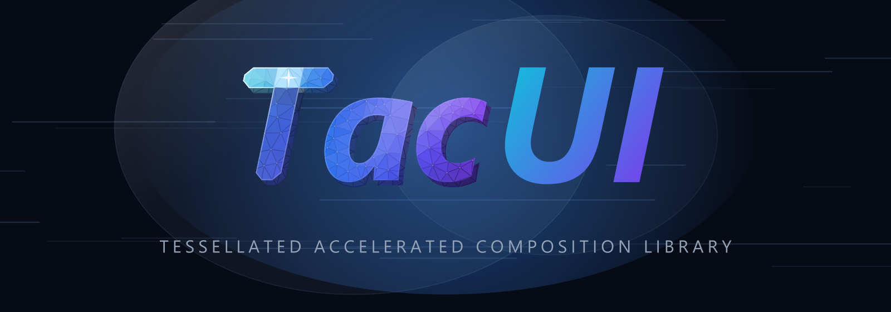

<p align="center">
  
</p>

# TacUI
Tessellated Accelerated Composition Library

Brand assets live in [`brand/`](brand/README.md) — the mark, lockups, app icon and brand guide.

---

## Status

**M0 (architecture validation) is complete.** A GPU-rendered, retained-mode UI
with a C++ core and a C ABI that a non-C++ language can drive. See
[docs/plan.md](docs/plan.md) §6.1 for exactly what that does and does not
include — the control library, layout engine and text stack are all still
minimal.

## Build

Windows, MSVC, CMake ≥ 3.25 and the Windows SDK. No third-party dependencies.

```sh
cmake -S . -B build -G "Visual Studio 18 2026" -A x64
cmake --build build --config Debug
```

| Target | What it is |
|--------|-----------|
| `asset_browser` | the example below — run this first |
| `m0` | the validation harness; `--selftest` asserts every M0 criterion |
| `tacui.dll` | the C ABI, for host languages (`bindings/python`) |
| `textprobe` | text stack in isolation, no GPU needed |

## Writing a UI

One include, and that is the whole surface:

```cpp
#include <tacui/tacui.hpp>
```

Everything under `include/tacui/` is public. Nothing under `core/`, `rhi/`,
`platform/` or `tools/` is — those are implementation, and application code
should never reach into them.

Runnable source: [`examples/asset_browser/main.cpp`](examples/asset_browser/main.cpp).
It is a list with a selection, a detail pane and an animated indicator — the
shape of the game-tool panels the project targets.

The same panel also exists as
[`examples/asset_browser/browser.py`](examples/asset_browser/browser.py),
running against the identical core through the C ABI. The two produce the same
image; only the host language differs.

```cpp
ui::VNode* buildUi(ui::Builder& b, App& app) {
    const int selected = static_cast<int>(app.ui->state(kSlotSelected, 0));

    auto root = b.stack();

    b.text("Scene Browser").box(20, 20, 400, 28).size(19).color(kTextStrong);
    b.rect().box(20, 68, 760, 1).color(kDivider);

    for (int i = 0; i < kItemCount; ++i) {
        const float y   = rowTop(i);
        const bool  sel = (i == selected);
        const bool  hot = (i == app.hoverRow);

        b.rect().box(kListX, y, kListW, kRowH).radius(8)
            .color(sel ? kRowSelected : (hot ? kRowHover : kRowPlain))
            .key(kRowBase + i);

        b.text(kItems[i].name).box(kListX + 36, y + 7, kListW - 48, 24)
            .size(16).color(sel ? kTextStrong : kTextDim);
    }

    return b.root();
}
```

Input is plain C++ — nothing is hidden behind a binding layer:

```cpp
auto onEvent = [&app](const host::Event& ev) {
    if (ev.type != host::EventType::MouseDown) return;
    for (int i = 0; i < kItemCount; ++i) {
        if (Rect{ kListX, rowTop(i), kListW, kRowH }.contains(ev.x, ev.y)) {
            app.ui->setState(kSlotSelected, i);   // schedules a rebuild
            return;
        }
    }
};
```

## Two ways to change something

This is the idea the rest of the design serves.

The usual declarative path rebuilds a description and diffs it. That is the
right default, but it is the wrong tool for anything that changes every frame.

So every animatable property has **two channels**, and the effective value is
simply *override if a token is alive, otherwise base*:

```
path A · declare   change state -> rebuild -> diff -> write base
path B · direct    write an override  -> repaint only, no rebuild

effective = override (while its token lives)  else base
```

An animation takes a lease once and writes through it forever after:

```cpp
// Acquired once, held across every rebuild:
app.scan = app.ui->find(kScanFill).beginOverride();

// Every frame. Never marks the tree dirty, never triggers a rebuild.
app.scan.setTranslate(phase * kScanSpan, 0.0f);
```

The example's own numbers, printed once a second:

```
rebuilds=1  paints=641  |  shaped=15 glyphs=78 quads=125  |  liveOverrides=1
```

641 frames drawn, **one** rebuild — the initial one. The scanning indicator
moved for all 641 of them without the widget tree being touched. Hover a row
instead and `rebuilds` climbs, because hover changes a *base* colour.

Nothing is special-cased for "interactive" versus "animated": the decision
lives at the level of a single property, not the whole framework.

## Where the design is written down

- [docs/plan.md](docs/plan.md) — decisions and milestones; §6.1 is current status
- [docs/architecture.md](docs/architecture.md) — the reasoning, including why
  this is not WPF's model, what GacUI got right, and what WinUI accidentally proved

```
include/tacui/   the public API — tacui.hpp (C++) and tacui.h (C ABI)
core/            framework, renderer, text    — no platform dependency
rhi/             backend-agnostic interface + the D3D12 backend
platform/        window, input, (later) IME and DPI
host/            a ready-made Win32 + D3D12 shell for examples and tools
capi/            the C ABI implementation — the only cross-language boundary
bindings/        host-language wrappers; python/ is the worked example
examples/        asset_browser (C++ and Python)
apps/            m0 (validation harness), textprobe
```

The core is embeddable: an application that already owns a window and a
renderer drives `ui.update()` and `ui.paint()` itself and never touches
`host/`. `host::run` is the convenience path.

## Website & docs

The product site and the documentation are one MkDocs build:
**https://terry-chao.github.io/TacUI/** (deployed from `main` by
`.github/workflows/pages.yml`).

```sh
pip install -r requirements.txt
mkdocs serve     # local preview at http://127.0.0.1:8000
mkdocs build     # output in site/ (git-ignored)
```

| What you want to change | Where it lives |
|---|---|
| Landing page (hero / features / workflow / architecture / quickstart) | `overrides/home.html` + `docs/css/home.css` |
| Top bar, three-column doc layout, footer, shared components | `overrides/nav.html`, `overrides/docs-layout.html`, `overrides/footer.html`, `docs/css/brand.css` |
| 404 page | `overrides/404.html` |
| Doc sidebar tree | `overrides/nav-tree.html` (structure comes from `nav:` in `mkdocs.yml`) |
| Small interactions (mobile menu, transparent hero header, wide tables) | `docs/js/site.js` |
| Page content | `docs/*.md` |

Two things that bite:

1. In templates, link to a page by its **page URL** (`{{ 'python/'|url }}`), not
   `python.md` — MkDocs' `url` filter only makes it relative, it does not turn
   `.md` into a page URL. (Markdown links in `docs/` *are* converted for you.)
2. The landing page icons live in `docs/img/icons/`; `mkdocs build` copies
   `docs/` into the site, so anything the site needs must be under `docs/`.
