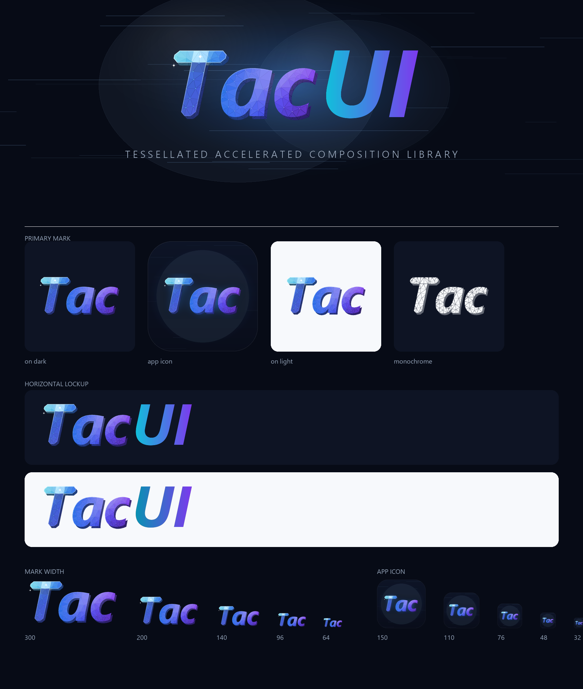

# TacUI 品牌资源

> Tessellated Accelerated Composition Library



**展示图（可直接用作 README 头图）**：`tacui-hero.svg` / `png/tacui-hero.png`

---

## 1. 结构：图形承担 "Tac"，字标承担 "UI"

标志图形是**整个词 "Tac"**，不是只有一个首字母。所以组合起来时：

```
[ 三角网格的 "Tac" ]  +  [ 排版的 "UI" ]   →   读作 "TacUI"
```

左右两半**共用同一条基线和同一个 cap height**，因此组合看起来是一个词，而不是
"一个符号 + 一个名字"。而且两半都用**斜体**，倾斜方向一致。

**用真斜体，不用机械倾斜。** 字形取自 Segoe UI Bold *Italic*（`segoeuiz.ttf`）——
是字体设计师画过的斜体，不是把正体推一下就完事。它的 `T` 依然是一个规整的八点矩形
八边形，所以切角那套做法可以原样保留，只是横杠和竖笔从矩形变成了平行四边形。

**字距收紧到互相咬合**：`a` 塞在 `T` 右臂下方，`a` 和 `c` 几乎相触。
这样它读起来是一个设计过的 logotype，而不是排好版的三个字母。

**它是一块有厚度的实体**，不是贴在背景上的字：整个词沿光照反方向挤出 6.5×7.5 单位，
得到一圈带面片结构的侧壁。所以它有重量、有体积。

图形单独使用时就是 "Tac" 这个词标——App 图标、favicon、仓库头像都用它。

---

## 2. 每一层在说什么

| 元素 | 对应能力 |
|------|---------|
| **T 的两块平面** | 图层合成。`T` 的横杠是横向平面，竖笔是纵向平面（斜体下是两个平行四边形），交叠的地方用 `screen` 混合成高亮核心 |
| **核心的光会溢出** | 加性混合本来就不认父矩形的边界；核心的光渗到相邻面片上，这个细节才是"合成" |
| **接触阴影** | 竖平面从横平面下方探出来的地方压了一道阴影，两块板是"叠起来"而不是"拼起来"。斜体下这条边界是一条斜线，阴影按点到这条线的距离算 |
| **Delaunay 三角网格** | 三角剖分。顶点是不规则点集（字形轮廓抽稀 + 抖动栅格），再做 3 轮 Lloyd 松弛（每个自由顶点移到相邻三角形外心的平均位置，即 Voronoi 质心），得到疏密均匀、没有细长三角形的网格 |
| **网格顺着倾斜方向流动** | 栅格按 `MESH_FLOW` 做切变，三角形沿斜体轴被拉长，纹理是"流"的而不是静态蜂窝 |
| **顶点节点** | 每个内部顶点一个小亮点，明确点出"这是三角剖分的顶点"，而不是低多边形插画 |
| **平面着色 + 高光** | GPU 加速。逐面片按高度场法线做 Lambert 漫反射；法线额外叠加一点逐面片抖动（真实低多边形表面就是不平整的），**高光只用光滑法线算**，所以高光扫成一条连续亮带，而不是碎钻一样的闪点 |
| **倒角边** | 每个面片的描边跟着它自己的受光量走：迎光的面片边缘发亮，背光的面片边缘压暗。这样表面读起来是**切面晶体**，而不是"渐变上盖了一层线框" |
| **挤出侧壁（厚度）** | 同一套三角网格整体偏移 6.5×7.5，色相压到 `DEPTH_TINT`。侧壁保留面片结构（不是填一块纯色），否则会读成投影而不是实体 |
| **星芒** | 两颗四角星，位置是自动挑的：一颗在合成核心，一颗在"离核心足够远、受光最强"的面片上。这是参考图里那种高光碎钻 |
| **速度线 / 玻璃** | 只在展示图上用（`layout_hero()` 和应用图标）：横向细线是"GPU 加速"的视觉motif，半透明圆盘是"图层"的具象。**不放进标志本体**，否则 60px 下就糊了 |
| **边缘高光（rim light）** | 沿字形轮廓内侧一道从左上到右下衰减的高光，标志读起来是一块被照亮的实体 |
| **T 的切角** | 把 `T` 的 6 个外角切掉 11 单位——轮廓像是"从板材上切出来的"。两个凹角保持尖角 |
| **青 → 蓝 → 靛 → 紫横扫** | 冷色科技感：`T` 青、`a` 蓝、`c` 蓝紫；纵向平面另有一条靛→紫的竖向渐变 |

**字形有孔洞**：`a` 的字碗（counter）必须是空的。遮盖用的路径按 even-odd 填充，
位图侧的遮罩按轮廓绕向区分外壳和孔洞。

---

## 3. 文件清单

### 矢量（`brand/`）

| 文件 | 用途 |
|------|------|
| `tacui-mark.svg` | 主标志：三角网格的斜体 "Tac"（横版，约 1.9:1） |
| `tacui-mark-mono.svg` | 单色版，实心轮廓挖空网格线，可放任意底色 |
| `tacui-wordmark.svg` / `-dark.svg` | 纯字标 "TacUI"，用于放不下图形标志的场合 |
| `tacui-logo-horizontal.svg` / `-dark.svg` | 横排组合 `Tac` + `UI`，**默认首选** |
| `tacui-logo-horizontal-tagline.svg` / `-dark.svg` | 横排 + 全称副标，用于文档头图 |
| `tacui-logo-stacked.svg` / `-dark.svg` | 竖排：`Tac` 在上、`UI` 在下、副标在底 |
| `tacui-hero.svg` | 展示图：玻璃 + 速度线 + 光晕 + 组合，1600×560，**README 头图** |

`-dark` 后缀表示**浅色字**，用于深色背景；不带后缀的是**深色字**，用于浅色背景。
字标已经转成路径，任何环境都能正确显示，不依赖机器上装了 Segoe UI。

### 位图（`brand/png/`）

| 文件 | 用途 |
|------|------|
| `tacui-mark-512/1024/2048.png` | 标志位图导出（宽度 × 高度 ≈ 1.9:1） || `tacui-mark-mono-1024.png` | 单色标志 |
| `tacui-app-icon-1024.png` | 应用图标（浅色圆角底板 + 蓝色标志） |
| `tacui-logo-lockup-2048.png` | 手绘完整组合稿（图 + 字，浅色底，已去水印）；图标 / 站点 Logo 的源图 |
| `tacui-logo-horizontal.png` / `-dark.png` | 横排组合，透明底 / 深色底板 |
| `tacui-logo-stacked.png` / `-dark.png` | 竖排组合的两种底色 |
| `tacui-brand-sheet.png` | 品牌总览图（本文件顶部那张） |
| `tacui-hero.png` | 展示图位图版（1600×560），背景已烘焙成深色 |

---

## 4. 颜色

| 名称 | 色值 | 用途 |
|------|------|------|
| Cyan | `#12BEDB` | 横扫起点（`T`） |
| Blue | `#2563EB` | 横扫中段（`a`） |
| Indigo | `#4338CA` | 竖向平面渐变的起点 |
| Violet | `#7C3AED` | 横扫终点（`c`）与 `UI` 字标渐变终点 |
| Core | `#BEEBFF` | 交叠核心的发光色（向外溢出） |
| Ink Dark | `#0B1220` | 浅色背景上的文字 |
| Ink Light | `#F8FAFC` | 深色背景上的文字 |
| Muted Dark | `#64748B` | 浅色背景上的副标 |
| Muted Light | `#94A3B8` | 深色背景上的副标 |
| Background | `#070B16` | 深色底板 / 品牌图底色 |

浅色背景下字标渐变会切到更深的 `#0891B2 → #7C3AED`。
这些是"输入色"——实际面片颜色由光照决定，会比色板更亮或更暗。

---

## 5. 使用规则

**留白**：四周至少留出标志高度 1/4 的空白。

**最小尺寸**：
- 图形标志（"Tac"）：宽度不小于 **60px**，再小 "ac" 就糊成一团了
- 含字标的组合：宽度不小于 **180px**

**要避免的**：
- ❌ 拉伸或压扁（始终等比缩放）
- ❌ 改渐变颜色或给面片上别的色
- ❌ 加描边、投影、外发光（应用图标自带的底板和光晕除外）
- ❌ 把图形标志和完整字标 "TacUI" 并排放在一起——图形已经是 "Tac" 了，会读成 "TacTacUI"。
  只有图形时用 `tacui-mark`，图形 + 字标时字标只用 `UI`，纯文字时才用完整的 `tacui-wordmark`
- ❌ 在杂乱的照片/噪点背景上放彩色版——这种情况用单色版

**单色版怎么用**：`tacui-mark-mono.svg` 是"实心轮廓挖掉网格线"的做法，
把 `fill` 换成任意颜色即可，深浅底色都能用。

---

## 6. 重新生成

```bash
python brand/tools/build_brand.py      # 生成 brand/*.svg 和 brand/png/*
python brand/tools/mesh_variants.py    # 渲染网格参数对比图，用于调网格
```

`build_brand.py` 顶部是全部可调参数：

| 参数 | 作用 |
|------|------|
| `WORD` / `WORD_TRACKING` | 图形里的词和字距（负值越大咬合越紧） |
| `FACE` | 图形用的字体；默认 `segoeuiz.ttf`（Bold Italic） |
| `MARK_CAP` / `MARK_PAD` | 画布里的 cap height 与留白（`MARK_W`/`MARK_H` 由它推出） |
| `CHAMFER` | `T` 的切角大小 |
| `MESH_SPACING` / `MESH_JITTER` / `MESH_SEED` | 网格密度、抖动、随机种子 |
| `MESH_FLOW` | 栅格切变量；0 = 正网格，越大越顺着斜体方向流动 |
| `RELAX_STEPS` | Lloyd 松弛轮数（0 = 不松弛，能看到明显的星芒和细长三角形） |
| `LIGHT_DIR` / `height_field()` | 光源方向与表面起伏 |
| `CORE_BLOOM` / `CORE_BLEED` | 核心发光半径与溢出半径 |
| `EXTRUDE` / `DEPTH_MIX` / `DEPTH_TINT` | 挤出的位移、侧壁压暗程度与压向的颜色 |
| `ICON_CAP` | 应用图标里字标的大小 |

展示图（`layout_hero()`）另外还有三个元素类型可以调：`_streaks()` 速度线、
`_glow()` 光晕、`_glass()` 玻璃圆盘。它们在 SVG 和位图两侧都有实现，改一处两边同步。

两个渲染器共用同一份几何：SVG 走 `emit_svg()`，位图走 Pillow（`mark_image()` /
`render_layout_png()`），所以矢量稿和位图稿不会走样。字形轮廓由
`tools/ttf_outline.py` 从字体抽出，SVG 侧转成路径，位图侧用同一套字体度量排版。

`T` 的两块平面和四个颜色区域是**从 `T` 自己的轮廓上量出来的平行四边形**，不是写死的
矩形——所以换字体或换斜体角度都不需要改几何代码。区域裁剪用 `clip_convex()`，
支持任意凸多边形。

依赖：Python + Pillow + numpy，以及系统里的 `segoeuiz.ttf`（图形）、
`segoeuib.ttf` / `segoeui.ttf`（副标）。
