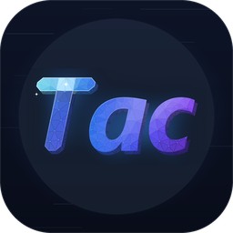

# 品牌与资源

> Tessellated Accelerated Composition Library


---

## 标志：图形承担 "Tac"，字标承担 "UI"

标志图形是整个词 **"Tac"**，不是只有一个首字母。组合起来时：

```
[ 三角网格的 "Tac" ]  +  [ 排版的 "UI" ]   →   读作 "TacUI"
```

左右两半共用同一条基线和同一个 cap height，都用**真斜体**（不是机械倾斜），
所以读起来是一个设计过的 logotype，而不是「一个符号 + 一个名字」。

图形是一块**有厚度的实体**：整个词沿光照反方向挤出，得到一圈带面片结构的侧壁。
单独使用时它就是 "Tac" 词标 —— App 图标、favicon、仓库头像都用它。



---

## 颜色

| 名称 | 色值 | 用途 |
|------|------|------|
| Cyan | `#12BEDB` | 横扫起点（`T`） |
| Blue | `#2563EB` | 横扫中段（`a`） |
| Indigo | `#4338CA` | 竖向平面渐变的起点 |
| Violet | `#7C3AED` | 横扫终点（`c`）与 `UI` 字标渐变终点 |
| Core | `#BEEBFF` | 交叠核心的发光色（向外溢出） |
| Ink Dark | `#0B1220` | 浅色背景上的文字 |
| Ink Light | `#F8FAFC` | 深色背景上的文字 |
| Muted Dark | `#64748B` | 浅色背景上的副标 |
| Muted Light | `#94A3B8` | 深色背景上的副标 |
| Background | `#070B16` | 深色底板 / 品牌图底色 |

浅色背景下的字标渐变会切到更深的 `#0891B2 → #7C3AED`。这些是「输入色」——
实际面片颜色由光照决定，会比色板更亮或更暗。

本站的界面配色就是这套色板：`--tm-accent: #2563eb`、`--tm-cyan: #12bedb`、
`--tm-violet: #7c3aed` 定义在 `docs/css/brand.css`。

---

## 文件清单

### 矢量（[`brand/`](https://github.com/terry-chao/TacUI/tree/main/brand)）

| 文件 | 用途 |
|------|------|
| `tacui-mark.svg` | 主标志：三角网格的斜体 "Tac"（横版，约 1.9:1） |
| `tacui-mark-mono.svg` | 单色版，实心轮廓挖空网格线，可放任意底色 |
| `tacui-wordmark.svg` / `-dark.svg` | 纯字标 "TacUI" |
| `tacui-logo-horizontal.svg` / `-dark.svg` | 横排组合 `Tac` + `UI`，**默认首选** |
| `tacui-logo-horizontal-tagline.svg` / `-dark.svg` | 横排 + 全称副标，用于文档头图 |
| `tacui-logo-stacked.svg` / `-dark.svg` | 竖排：`Tac` 在上、`UI` 在下、副标在底 |
| `tacui-hero.svg` | 展示图：玻璃 + 速度线 + 光晕 + 组合，1600×560 |

`-dark` 后缀表示**浅色字**，用于深色背景；不带后缀的是**深色字**，用于浅色背景。
字标已经转成路径，任何环境都能正确显示，不依赖机器上装了 Segoe UI。

### 位图（`brand/png/`）

标志位图导出、单色标志、App 图标（深色圆角底板 + 光晕）、横排 / 竖排组合的两种底色、
品牌总览图，以及 1600×560 的展示图。

---

## 使用规则

**留白**：四周至少留出标志高度 1/4 的空白。

**最小尺寸**：

- 图形标志（"Tac"）：宽度不小于 **60px**，再小 "ac" 就糊成一团了
- 含字标的组合：宽度不小于 **180px**

**要避免的**：

- ❌ 拉伸或压扁（始终等比缩放）
- ❌ 改渐变颜色或给面片上别的色
- ❌ 加描边、投影、外发光（App 图标自带的底板和光晕除外）
- ❌ 把图形标志和完整字标 "TacUI" 并排放在一起 —— 图形已经是 "Tac" 了，会读成 "TacTacUI"
- ❌ 在杂乱的照片 / 噪点背景上放彩色版 —— 这种情况用单色版

**单色版怎么用**：`tacui-mark-mono.svg` 是「实心轮廓挖掉网格线」的做法，
把 `fill` 换成任意颜色即可，深浅底色都能用。

---

## 重新生成

```bash
python brand/tools/build_brand.py      # 生成 brand/*.svg 和 brand/png/*
python brand/tools/mesh_variants.py    # 渲染网格参数对比图，用于调网格
```

两个渲染器共用同一份几何：SVG 走 `emit_svg()`，位图走 Pillow，
所以矢量稿和位图稿不会走样。依赖 Python + Pillow + numpy，
以及系统里的 `segoeuiz.ttf`（图形）、`segoeuib.ttf` / `segoeui.ttf`（副标）。

完整的可调参数与设计说明见 [`brand/README.md`](https://github.com/terry-chao/TacUI/blob/main/brand/README.md)。
