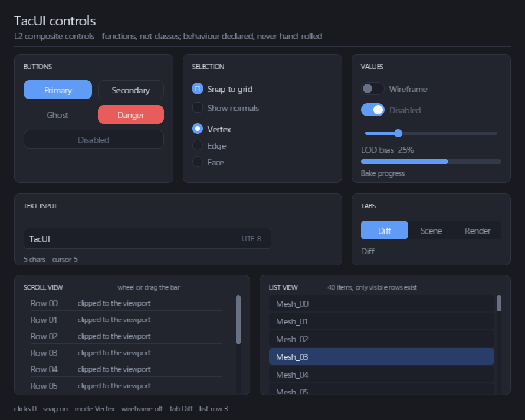

# 控件库

> 状态：**控件层已成型。** 12 个 L2 复合控件 + 主题令牌，加上裁剪、
> 事件冒泡、滚轮与虚拟化支撑起来的 `ScrollView` / `ListView`。
> `TextInput` 以「宿主持有缓冲」的形态先跑通输入与编辑；布局（Measure / Arrange）
> 仍是 M2 的事，控件目前由调用方给绝对盒。



截图就是 `controls_gallery --capture` 的输出，可以直接当回归基准。

---

## 一句话规则

**组件是函数，不是类。**

```cpp
ui::button(b, kSave, { 20, 20, 96, 30 },
           { .label = "Save", .style = ui::ButtonStyle::Primary },
           [&app] { app.save(); });
```

这和 Flutter / SwiftUI 一致，也是跨 C ABI 唯一可行的形态 —— 类继承没法跨语言。
每个控件向 arena 里发射 VNode，并向输入系统登记自己的行为；**它自己不持有任何状态**。

由此得到两条构造上的保证：

* **视觉盒 = 命中盒**：两者都是同一个 `box` 参数，不可能漂移；
* **亮起来的区域 = 响应的区域**：hover / press / focus 从 `Ui` 读回，
  控件不做本地追踪。

---

## 组件清单

全部声明在 [`include/tacui/controls.hpp`](https://github.com/terry-chao/TacUI/blob/main/include/tacui/controls.hpp)，
实现在 `core/controls/controls.cpp`。

| 组件 | 样式 / 参数 | 交互 |
|------|------------|------|
| `label` | `size` · `color` · `strong` | 无（纯展示） |
| `button` | `ButtonStyle::{Primary, Secondary, Ghost, Danger}` · `enabled` | 点击 · Space / Enter · 焦点环 |
| `checkbox` | `checked` · `enabled` · `label` | 点击整行切换 · 键盘激活 |
| `radio` | `selected` · `enabled` | 点击选中 · 键盘激活 |
| `toggle` | `on` · `enabled`（开关样式） | 点击切换 |
| `slider` | `value` · `min` · `max` · `step` | **拖拽捕获** · 点击跳转 · 方向键微调 |
| `progressBar` | `value` 0–1 · `color` | 无（纯展示） |
| `divider` | `color` | 无 |
| `panel` | `fill` · `radius` · `border`，返回 `Scope` 容纳子节点 | 无 |
| `listItem` | `label` · `secondary` · `selected` | 点击选中 |
| `tabs` | `labels` · `count` · `selected`，键从 `firstKey + i` 起 | 点击切换 |
| `scrollView` | `contentHeight` · `lineStep`，返回 `Scope` 容纳内容 | 滚轮 · 内容裁剪 |
| `scrollBar` | `contentHeight` · `width` · `minThumb` | 拖拽 · 点击跳转 |
| `listView` | `labels` · `secondary` · `count` · `selected` · `rowHeight` | 滚轮 · 拖拽 · **虚拟化** · 选中 |
| `textInput` | `placeholder` · `suffix` · `maxLength` · `enabled` | 编辑 · 选区 · 光标 |

### TextInput 的编辑能力

光标是字节偏移，且永远落在码点边界上。支持：

| 按键 | 行为 |
|------|------|
| 可打印字符 | 插入（替换选区） |
| `Backspace` / `Delete` | 删除选区，或前 / 后一个**码点** |
| `←` / `→` | 移动光标；按住 Shift 扩展选区 |
| `Home` / `End` | 跳到行首 / 行尾 |

已知限制（都是 M0 文本栈的边界）：单行不换行、无横向滚动裁剪、光标不闪烁、
无 IME 组合、无剪贴板。

---

## 裁剪、冒泡与容器

`ScrollView` / `ListView` 不是「画一个框把内容盖住」，而是三层机制一起工作：

**1 · 裁剪** —— `Builder::clip(box, key)` 打开一个裁剪容器。它在树上只记一个矩形，
绘制时并进图元的 `rhi::ClipRect` 交给着色器 scissor，命中测试时**同一个矩形**
把区域外的节点排除掉。所以「看得到的范围」和「点得到的范围」仍然是一份数据
（`components.md` §2 的四个要点之一）。

```cpp
{
    auto view = ui::scrollView(b, kScroll, box, state, { .contentHeight = h });
    // 内容按 box.y - state.offset 摆放，超出 box 的部分自动被剪掉
}
ui::scrollBar(b, kScrollBar, box, state.offset, { .contentHeight = h });
```

**2 · 冒泡** —— 命中测试返回一条链，事件沿着它找第一个愿意处理的节点。
滚轮在列表行上没人处理，就冒泡到列表容器去滚动；行里的按钮拿到点击后，
行不会跟着被选中。

**3 · 虚拟化** —— `listView` 只发射与视口相交的那些行。一万条的列表和十条的列表
节点数一样多：`--input-test` 直接断言四十条的列表里存活的节点少于 14 个。

`ScrollView` 与 `ListView` 的滚轮在**已经在端点**时会返回 `false` 而不是吞掉事件，
所以嵌套滚动里手势会交给外层容器。

---

## 主题令牌

控件不硬编码颜色与尺寸，全部读 [`Theme`](https://github.com/terry-chao/TacUI/blob/main/include/tacui/theme.hpp)：

```cpp
struct Theme {
    Color background, surface, surfaceAlt, surfaceHover, surfaceActive;
    Color textStrong, textDim, textFaint, textOnAccent;
    Color border, borderStrong, accent, accentHover, accentSoft, danger, success, focusRing;
    float radiusSm, radiusMd, radiusLg, radiusPill;
    float spaceXs, spaceSm, spaceMd, spaceLg;
    float fontSm, fontMd, fontLg, fontXl;
};
```

内置 `darkTheme()` / `lightTheme()`，运行时换肤就是换一个结构体：

```cpp
ui.setTheme(ui::lightTheme());
```

令牌是在控件之前抽出来的（`components.md` 的 C4 决策）—— 事后再抽要改遍每个控件。
`darkTheme()` 复刻了示例原本硬编码的调色板，所以抽取没有改变原来的样子。

---

## 输入系统提供了什么

控件之所以能写得这么薄，是因为这些都在 core 里：

| 能力 | 谁负责 |
|------|--------|
| 命中测试（绘制顺序逆序、用 base bounds） | `Ui::hitTest` |
| **命中链与事件冒泡** | `Ui::hitChain`，按「谁消费谁负责」传播 |
| **裁剪（绘制与命中共用矩形）** | `Builder::clip` + `rhi::ClipRect` |
| hover / press / 失焦 | `Ui` 持有，`isHovered` / `isPressed` / `isFocused` 读回 |
| 焦点与 Tab 顺序 | `Ui::focusNext`，点击可聚焦节点夺焦 |
| 「按下后拖出去再松开不算点击」 | `Ui::dispatchEvent` |
| **拖拽捕获** | `NodeBehavior::onDrag`，按下时捕获，松开前一直收事件 |
| **滚轮** | `NodeBehavior::onWheel`，返回 `true` 表示消费、停止冒泡 |
| 键盘激活（Space / Enter） | 组件登记，输入系统分发 |

---

## 验证

```powershell
.\build\bin\controls_gallery.exe --input-test
```

**39 条断言，全部无窗口、无 GPU**，所以可以进 CI：

```
[PASS] disabled button does not fire
[PASS] slider takes the drag capture on press
[PASS] drag past the end clamps to max
[PASS] typing inserts characters
[PASS] backspace deletes a whole codepoint
[PASS] shift+arrow extends a selection
[PASS] typing replaces the selection
[PASS] Space activates the focused button
[PASS] hit chain is the row followed by its list container
[PASS] wheel over a row scrolls the list rather than being swallowed
[PASS] only the visible rows exist as nodes
[PASS] hit testing stops at the clip rectangle
[PASS] scroll view content is painted with the viewport scissor
[PASS] no primitive carries an unexpected scissor
```

裁剪是**两头都验**的：命中测试那侧断言区域外点不到，绘制那侧用一个记录型
`rhi::Device` 接住 `drawSdfRects` / `drawGlyphQuads`，断言视口里的每条图元都带上了
正确的 scissor、且没有一条带上意外的 scissor。显存那侧由 `--capture` 的截图兜底。

同一个可执行文件用 `--capture out.png` 出图，就是本页顶部那张。

---

## 下一步

| 顺序 | 内容 | 为什么 |
|---|---|---|
| ~~1~~ | ~~事件冒泡~~ | ✅ 已做 |
| ~~2~~ | ~~裁剪~~ | ✅ 已做 |
| **1** | **布局**（Measure / Arrange + BoxConstraints） | 控件现在靠调用方给绝对盒；`ListView` 的行高、`ScrollView` 的内容高度现在都要人来算 |
| 2 | `Popup` / `Menu` / `Tooltip` | 需要独立图层与焦点捕获，是目前唯一还缺的 L1 |
| 3 | 其余 L2 ：`Badge` `Toolbar` `Spinner` `Breadcrumb` | 体力活 |
| 4 | TextInput 升级为 L1：光标 / 选区搬到 Element，加 IME | 工程量大的一块 |

详见 [组件设计](components.md) §6。
