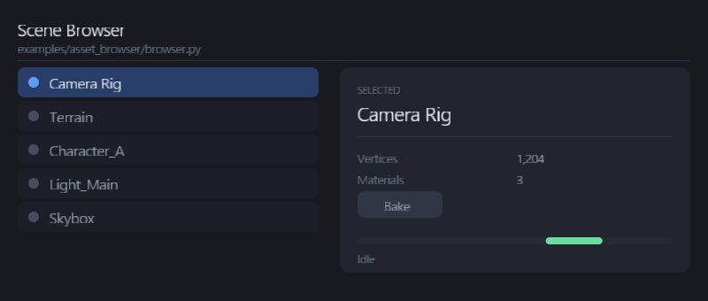

# C ABI 与 Python 绑定

跨语言只有**一个**边界：C ABI。内部 struct 永远不暴露出去，
宿主语言拿到的是 `NodeRef` —— 所以内部实现从 AoS 换成 SoA、把渲染搬到独立线程，
对绑定都是 drop-in 的。

---

## C ABI 的形状

句柄是**代际句柄**：`{ index, generation }` 两个 32 位整数。节点被销毁后，
旧句柄解析为 null，而不是指向另一个节点 —— 这就是 index + generation 这对组合的意义。

```c
// capi/ 导出面的形状（IDL 生成的目标）
tui_node_ref_t node = tui_scene_get_ref(scene, "marker_42");
tui_write_begin(node);
tui_write_f32(node, TUI_PROP_TRANSLATE_X, 120.0f);
tui_write_f32(node, TUI_PROP_TRANSLATE_Y,  88.0f);
tui_write_f32(node, TUI_PROP_OPACITY,       0.6f);
tui_write_commit(node);       // 离开作用域 → revoke
```

第一版**先不做 IDL**：让 C header 自己当那半个代码生成器，等第二个宿主语言落地
再抽共用的生成器。理由见 [方案](plan.md) §10.4。

ABA 版本通过 `TUI_ABI_VERSION` 协商；`tui_stats_size()` 让绑定在 import 时
比对结构体大小，把「ctypes 不校验大小 → 静默写穿缓冲区」这类内存破坏变成加载期报错。

---

## Python 侧的分工

`bindings/python/tacui.py` 是**手写**的 ctypes 绑定 —— 故意的。按 [方案](plan.md) §10，
FFI 管道是机械的部分；真正每个宿主语言都要自己写的是**地道的那一层**，
这个文件就是 Python 形状的它。

它演示的分工很干净：

```
C++   拥有窗口、GPU 设备、帧循环          (tui_run)
Python 拥有 UI：build 回调、事件处理、动画
```



---

## 跑一下

先构建出 `tacui.dll`（`capi/` 目标），然后：

```powershell
cd bindings\python
python demo.py                # 交互；点蓝色按钮，Esc 退出
python demo.py --selftest     # 脚本化断言，失败时退出码非 0
python demo.py --capture out.png
```

`demo.py` 不是「Hello World」：它跨 ABI 验证了 M0 的三条关键标准 ——

```
[PASS] criterion 3: painted nearly every frame
[PASS] criterion 2: host-driven setState caused rebuilds
[PASS] criterion 3: animation frames did not rebuild (rebuilds << paints)
[PASS] criterion 4: override survived repeated rebuilds
[PASS] criterion 4: coexist override still installed at exit
[PASS] retention: elements were reused across rebuilds, none destroyed
[PASS] criterion 6: tree dump produced nodes
```

同一份 core，同一个面板：`examples/asset_browser/browser.py` 与
`examples/asset_browser/main.cpp` 并排可读，布局、key、两条路径一一对应。

---

## 控件也在 ABI 里

控件层是 core 的（[组件设计](components.md) §4），所以宿主语言拿到的是**同一套控件**，
而不是各写一遍 hover / 命中测试。每个 L2 控件一个 `tui_*` 函数，Python 侧包成方法：

```python
with ui.stack():
    ui.label(0, (20, 20, 400, 28), "Controls from Python", size=22, strong=True)
    ui.button(K_OK, (20, 70, 120, 32), "Bake",
              style=tacui.BUTTON_PRIMARY, on_click=app.bake)
    ui.checkbox(K_SNAP, (20, 120, 200, 24), "Snap to grid",
                checked=app.snap, on_change=app.set_snap)
    ui.slider(K_LOD, (20, 160, 240, 24), value=app.lod, on_change=app.set_lod)
    ui.tabs(K_TABS, (20, 200, 240, 32), ["Diff", "Scene"], selected=app.tab,
            on_select=app.set_tab)

    with ui.panel(K_PANEL, (300, 70, 200, 120)):     # container：with 进出
        ui.label(0, (316, 86, 160, 20), "inside a panel", size=13)
```

颜色还是 `rgba8`（低位是 R）；**alpha 为 0 表示"不设置，用主题"**。
回调通过 ABI 的 `user` 指针 + 宿主侧闭包路由回 Python 对象 —— C ABI 从不持有语言的闭包。

已导出：`label` `button` `checkbox` `radio` `toggle` `slider` `progress` `divider`
`tabs` `panel`。有状态的 L1 也导出了 —— `textInput` / `scrollView` /
`listView` 的跨帧状态（编辑缓冲、滚动偏移）由**库按 key 托管**，宿主通过访问器
读写，而不是传缓冲区进来（控件的编辑回调按引用捕获这份状态，缓冲区方案会悬空）：

```python
ui.text_input(K_SEARCH, (20, 340, 240, 32), placeholder="search",
              on_change=app.set_query)
app.query = ui.text_get(K_SEARCH)        # 读回库托管的文本
ui.text_set(K_SEARCH, "")                # 或由宿主写入

with ui.scroll_view(K_SCROLL, box, content_height=content_h):   # 打开裁剪容器
    off = ui.scroll_offset(K_SCROLL)     # 读回偏移，用它摆放内容
    ...                                  # 发射内容
ui.scroll_bar(K_SCROLLBAR, K_SCROLL, box, content_height=content_h)

ui.list_view(K_LIST, box, labels, selected=app.row,
             row_key_base=K_ROW, on_select=app.set_row)   # 虚拟化 + 滚轮
```

---

## 无窗口驱动：输入注入与 `tui_update`

嵌入宿主自己拥有窗口循环时，以前**没有**把事件送进框架的入口；headless 测试
更是既不能注入输入、也不能触发重建。这两个缺口补上了：

```python
ui.dispatch(tacui.EVENT_MOUSE_DOWN, 60.0, 86.0)   # 注入一个事件
ui.dispatch(tacui.EVENT_CHAR, codepoint=ord("A")) # 字符
ui.dispatch(tacui.EVENT_MOUSE_WHEEL, 60.0, 86.0, wheel=-3.0)
ui.update()                                       # 脏则重建，返回是否重建
```

- `tui_dispatch_event` 走的是**和运行循环同一条**路径（`ui.dispatchEvent`），
  所以合成事件和真实事件行为一致；
- `tui_update` 让宿主自己驱动「脏则重建」，`tui_run` 每帧内部也调它。

反方向 —— 宿主**接收**事件 —— 也补齐了。`tui_host.event` 现在收到一个
`tui_event`（`type` / `x` / `y` / `key` / `codepoint` / `wheel` / `shift`），
所以宿主 App 能自己处理滚轮与字符，而不只是拿到鼠标和按键：

```python
class App(tacui.App):
    def event(self, ev):                     # ev.kind 是 EVENT_*
        if ev.kind == tacui.EVENT_MOUSE_WHEEL:
            app.zoom(-ev.wheel)
        elif ev.kind == tacui.EVENT_CHAR:
            app.feed(ev.codepoint)
```

这是 **ABI v2**：旧的五参数回调是 v1，签名变了就升一档。`tui_event_size()`
让绑定在 import 时比对结构体大小 —— 和 `tui_stats_size()` 同款，把结构体漂移变成加载期报错。

这让控件层可以**无窗口、无 GPU** 地验证：

```powershell
python bindings\python\controls_test.py
```

```
[PASS] a label reached the retained tree
[PASS] a panel nested its children
[PASS] clicking the button fires the Python callback
[PASS] clicking the checkbox flips the host value
[PASS] dragging the slider to the right reaches the end
[PASS] clicking a tab segment reports its index
[PASS] typing reaches the field's buffer
[PASS] clicking a list row reports its index
[PASS] the wheel scrolls the list
[PASS] the wheel scrolls the region
[PASS] a disabled button does not fire
```

---

## 写第二个宿主语言时暴露的 ABI 问题

这部分反馈比测试更有价值 —— 都是**只有换语言才会暴露**的问题：

- 代际句柄在 ctypes 下工作良好，`__bool__` 语义自然
- `user` 指针 + 宿主侧注册表是可行模式（比闭包更贴合 ABI 意图）
- **构建面确实 chatty**：每节点 3–4 次 FFI。可接受，但大树的批量提交迟早要做
- **ctypes 回调里抛异常不会传播进 C 循环** —— 宿主的错误会静默丢失，
  ABI 需要一条回传错误的路径（M1）
- 首帧回调曾经跑在树建立之前，宿主的句柄解析必然失败；`tui_run` 已统一为 UTF-8 字符串，
  并修正了这个时序

## 接着读

- [方案](plan.md) §5 与 §10 —— 边界设计原则与绑定工具链调研
- [架构](architecture.md) §5 —— 跨语言绑定
- [写一个 UI](building-ui.md) —— C++ 侧的同一套 API
